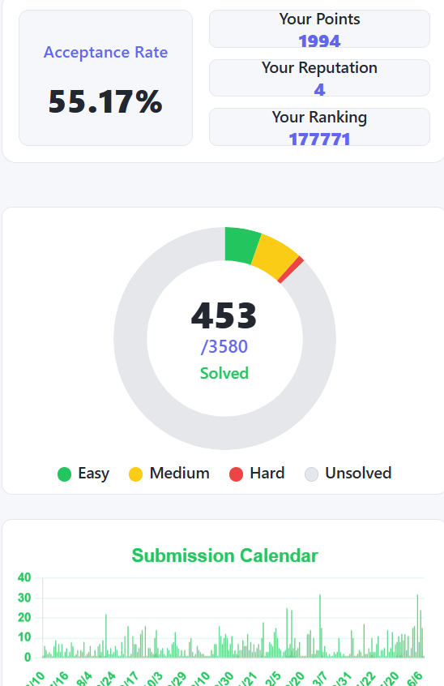

# Master JavaSscript
Here i Master javaScript with all concept from basic to advanced at the end I make the Project in HTML, CSS, Javascript called LeetProgress.

**LeetProgress** is a beautiful, modern dashboard to visualize your LeetCode journey.  
Track your solved problems, see your stats, and get motivated to keep coding — all in a clean, responsive UI built with **HTML, CSS, and JavaScript**.

---

## ✨ Features

- **Live LeetCode Stats**: Instantly fetch your latest solved problems, acceptance rate, ranking, and more.
- **Doughnut Pie Chart**: Visualize your Easy, Medium, Hard, and Unsolved problems in a stunning chart.
- **Submission Calendar**: See your daily submission streaks in a green-themed bar chart.
- **Profile Integration**: Your real LeetCode avatar and username, fetched live.
- **Responsive Design**: Looks great on desktop and mobile.
- **No Frameworks**: 100% HTML, CSS, and JavaScript — easy to understand and extend.

---

## 🌐 Live Demo

👉 **Try it now:**  
[https://leetprogress.netlify.app/](https://leetprogress.netlify.app/)

---

## 📸 Screenshots




---

## 🛠️ Tech Stack

- **HTML5**
- **CSS3** (Flexbox, Responsive)
- **JavaScript (ES6+)**
- [Chart.js](https://www.chartjs.org/) for beautiful charts
- **LeetCode Public APIs** (free forever!)

---

## 💡 How It Works

1. **Enter your LeetCode username** and hit submit.
2. Your stats and avatar are fetched live from LeetCode.
3. Instantly see your progress in charts and cards.

---

## 📦 Project Structure

```
LeetProgress/
├── index.html
├── style.css
├── script.js
```

---

## 🧑‍💻 Author
Aryan Chaudhary

---

## ⭐️ Star This Project

If you like LeetProgress, please consider starring the [GitHub repo](https://github.com/Aryan-chaudhry/Master-JavaScript/) and sharing with friends!

---

## 📣 Feedback & Contributions

- **Feedback:** Open an issue or [contact me](mailto:Aryanchaudhary2629@gmail.com)
- **Contributions:** PRs are welcome!

---

> **The Journey of Master Javascript is very facinating**
